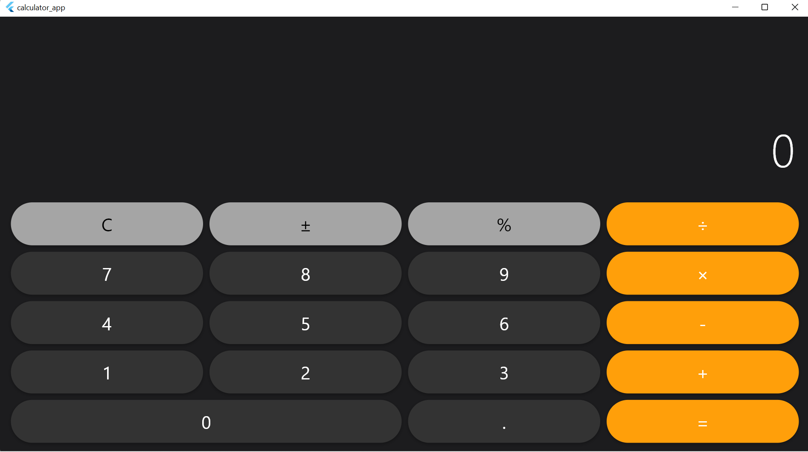

# Flutter Calculator App 
 
A clean iOS-style calculator built with Flutter. 
 
## Screenshot 
 
 
## Features 
- Basic arithmetic: +, -, x, ÷ 
- Clear, +/- , % operations 
- Responsive button layout 
- Custom reusable button widget 
 
## Run locally 
```bash 
flutter pub get 
flutter run -d windows 
``` 
